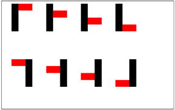
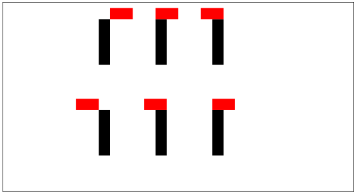
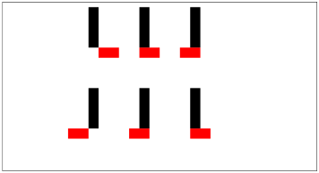

# Project 6: Pong Game

**October 23, 2023, Programming B**  
Department of Computer Engineering and Computer Science - Cesena Academic Year 2023-2024

**Submission Deadline**: by 23:59 on November 5, 2023.

## Specifications:

- Develop library functions to handle the movement of paddles and the ball in a Pong game.
- An implementation of the entire game is provided, except for the `game.c` library. The implementation uses the `curses` library.
- The function prototypes to be implemented are declared in the header `game.h`, which is attached with the specifications.
- The library functions in `game.c` should handle updates to the positions of the paddles and the ball in a way that is consistent with the game environment.
- The paddle and ball objects must be defined using structures in the `game.c` library, and these structures must not be visible outside.

## Constraints:

- The implementations must adhere to the provided prototypes and specifications.
- Any utility functions in the library must be hidden.
- It is not allowed to use pointers or pointer-specific notation in the development of the library functions.

## Suggestions:

- Start by implementing the `get_*` functions and then move on to the `move_pad*` functions.
- Modify `TIMEOUT` in `display.h` and `DELAY` in `main.c` to make the game slower.
- Attention: The function `setup_game()` resets the current game (including the score).
- Attention: The x-coordinate refers to the horizontal axis, while the y-coordinate refers to the vertical axis.

## Description of Game Elements:

- **Game Board**: Both the paddles and the ball move on a game board (matrix) with dimensions `(height+1) × (width+1)`, where the position `(0,0)` corresponds to the top-left corner and `(height,width)` corresponds to the bottom-right corner.
  
- **Paddles**: The paddles are represented as vertical bars of fixed length. The length of the paddles is chosen dynamically each time the game is run based on the size of the game board. The leftmost paddle is referred to as `paddle 1`, and the rightmost paddle is `paddle 2`. A paddle of length `n` will occupy the following positions on the game board:

  ```
  (y, x), (y + 1, x), ..., (y + n − 1, x)
  ```

  Where:

  - `0 ≤ x ≤ width`
  - `0 ≤ y ≤ y + n − 1 ≤ height`

  A paddle can only move vertically. Its x-position remains fixed throughout the game, while its y-position can vary within the limits of the board.

- **Ball**: A ball is represented (for graphical purposes) by two points: `(y, x)` and `(y, x + 1)`

  Where:

  - `0 ≤ x < x + 1 ≤ width`
  - `0 ≤ y ≤ height`

  When referring to the ball's position, we mean only the position `(y, x)`. The space occupied by the ball can be uniquely determined by this position.

## Description of Game Movements:

- **Paddle Movement**: Paddles can only move vertically. Not all vertical movements are allowed.

  Forbidden movements are as follows:
  
  - A paddle cannot move up if:
    1. It is at the top of the board (i.e., `y = 0`), or
    2. The ball touches the top of the paddle.
  
  - A paddle cannot move down if:
    1. It is at the bottom of the board (i.e., `y + n − 1 = height`), or
    2. The ball touches the bottom of the paddle.

- **Ball Movement**: The ball can move horizontally (LEFT/RIGHT) and vertically (UP/DOWN), encoded as:

  - `LEFT = −1`, `RIGHT = 1`, `UP = −1`, `DOWN = 1`

  The current movement direction of the ball is a pair `(V, H)`, where:

  - `V ∈ {UP, DOWN}`
  - `H ∈ {LEFT, RIGHT}`

  If the ball is at position `(y, x)` and moving in direction `(V, H)`, its new position will be `(y + V, x + H)`. The direction may change frequently during the game due to collisions, and these changes must follow the specified rules.


**Figures:**

1. **Full Touch.** Paddle 1 (black) and ball (red)  
	

2. **Touch on the Upper Edge.** Paddle 1 (black) and ball (red)  
	

3. **Touch on the Lower Edge.** Paddle 1 (black) and ball (red)  
	

## Detailed Function Descriptions:

- **`setup_game()`**: Sets up the initial game configuration:
  - The game board dimensions are fixed for the entire game using `height` and `width`.
  - The initial position of the ball is defined by `ball_pos`.
  - The initial movement direction of the ball is defined by `ball_dir`.
  - The initial positions of paddles 1 and 2 are defined by `pad1_pos` and `pad2_pos`.
  - The length of both paddles is specified by `pad_len`.

- **`move_ball()`**: Updates the direction of the ball (if necessary) and moves it accordingly. If a player scores, the ball position is reset to the starting position.

- **`move_pad1_up()`**: Moves paddle 1 one position up. If the move is not allowed, the position remains unchanged.

- **`move_pad1_down()`**: Moves paddle 1 one position down. If the move is not allowed, the position remains unchanged.

- **`move_pad2_up()`**: Moves paddle 2 one position up. Handled similarly to paddle 1.

- **`move_pad2_down()`**: Moves paddle 2 one position down. Handled similarly to paddle 1.

- **`get_pad1_pos()`**: Returns the current position of paddle 1.

- **`get_pad2_pos()`**: Returns the current position of paddle 2.

- **`get_pad1_len()`**: Returns the length of paddle 1.

- **`get_pad2_len()`**: Returns the length of paddle 2.

- **`get_pad1_score()`**: Returns the current score of player 1.

- **`get_pad2_score()`**: Returns the current score of player 2.

## Header File Example (`game.h`):

```c
#ifndef GAME_H
#define GAME_H

struct position {
    int x;
    int y;
};

/*
 * Setup a game with the following starting configuration:
 * - table dimension equal to height*width
 * - ball starting position at ball_pos
 * - ball starting direction towards ball_dir
 * - pad1 starting position at pad1_pos
 * - pad2 starting position at pad2_pos
 * - pad length equal to pad_len
 */
void setup_game(int height, int width, struct position ball_pos, 
                struct position ball_dir, struct position pad1_pos, 
                struct position pad2_pos, int pad_len);

/* Moves pad1 one position up */
void move_pad1_up(void);

/* Moves pad2 one position up */
void move_pad2_up(void);

/* Moves pad1 one position down */
void move_pad1_down(void);

/* Moves pad2 one position down */
void move_pad2_down(void);

/* Moves the ball in the current direction */
void move_ball(void);

/* Returns ball current position */
struct position get_ball_pos(void);

/* Returns pad1 current position */
struct position get_pad1_pos(void);

/* Returns pad2 current position */
struct position get_pad2_pos(void);

/* Returns the pad length */
unsigned int get_pad_len(void);

/* Returns pad1 current score */
unsigned int get_pad1_score(void);

/* Returns pad2 current score */
unsigned int get_pad2_score(void);

#endif
```